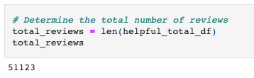
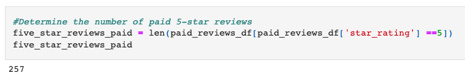
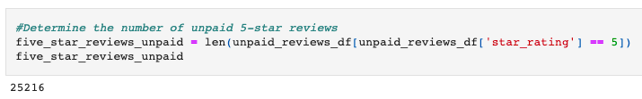
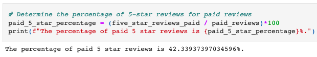
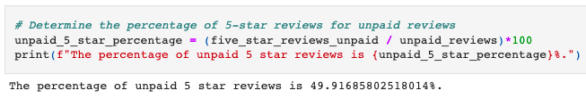

# Amazon Vine Analysis

[Link to ETL Code](https://github.com/c-geisel/Amazon_Vine_Analysis/blob/main/Amazon_Reviews_ETL.ipynb)

[Link to Review Analysis Code](https://github.com/c-geisel/Amazon_Vine_Analysis/blob/main/Vine_Review_Analysis.ipynb)

## Overview of the analysis 
Companies can pay a fee to establishments (such as Amazon Vine) to write reviews for their products. In this project, 50 datasets are supplied and an analysis on one is performed. The ETL process is used to connect to an AWS RDS instance and then load the transformed data into pgAdmin. After this, Pandas is used to determine if there is any positivity bias using reviews that were paid for. 

## Results 
After transforming and uploading the dataset, an analysis is performed. The total the number of paid and unpaid reviews, and the percentage of paid and unpaid reviews that were five stars are found. The following results were found: 
- Overall, there was a total of 51,123 paid (vine) and unpaid (non-Vine) reviews of all star ratings.

- 257 vine reviews were 5 stars.

- 25,216 non-Vine reviews were 5 stars.

- 42.34% of Vine reviews were 5 stars.

- 49.92% of non-Vine reviews were 5 stars.

## Summary
Being that the percentage of Vine reviews that were 5 stars is 42.34% and the percentage of non-Vine reviews were 49.92%, it can be concluded that there is not a positivity bias towards the paid reviews. 

This analysis only looks at the bias in 5-star ratings. Another beneficial analysis would be to perform the same tests on each star rating. As it stands currently, the percentage of Vine and non-Vine ratings for 5 starts are close, but it would serve good purpose to ensure that the other star ratings have a similar distribution as well.

